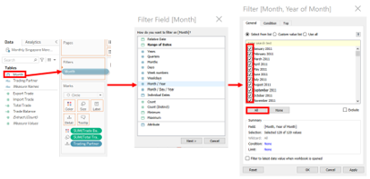
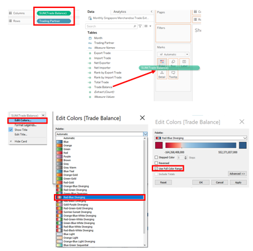

```{r setup, include=FALSE}
knitr::opts_chunk$set(echo = FALSE)
```

# 1.0 Critique of Visualisation

The original visualisation can be seen below.


The data visualisation above is created by using data provided by Department of Statistics, Singapore (DOS). 
The data are available under [the sub-section of Merchandise Trade by Region/Market.](https://www.singstat.gov.sg/find-data/search-by-theme/trade-and-investment/merchandise-trade/latest-data)  

### 1.1 Clarity

S/N | Critiques 
-----|------------
**(a) Improper labelling and formatting of both X-Axis and Y-Axis:** | There is no unit of measurements on both Axis. There is a lack of gridline or reference line for viewer to reference to the value on both Axis. Using Taiwan as a example, the trading value is $75.2 Bil which seems to imply that part of the value refer to the Y-Axis on the Imports value and part of the value refer to the X-Axis on the Exports value, however the view will have difficulty interpreting that as there is no proper gridline on both Axis for viewer to refer and reader will not understand the value label on both Axis.
**b) Ambiguous representation of trade value on the Trading Partner:** | There is no breakdown on what the Trade Value mean in the chart. Viewer will have difficulty understanding what the trade value is represented for as the chart is divided on X-Axis for exports and Y-Axis for imports but there is lack of information on how the Trade Value is being derived.
**(c) Both Axis does not start from Zero:** | There is no indication of the value at the start of both Axis and this will result in misrepresentation of the reading of the chart. In the example of Thailand with a Trade value of $33.0 Bil and it is the range of 20-30 on the X Axis and close to 20 on the Y Axis. If both the Axis will be start from 0, will the positioning of the circle for Thailand will be different? This can result in viewer misinterpreting the result of the chart. 
**(d) Ambiguous representation with small and big circle on each trading Partner:** | The viewer will need help whether to use the white small circle or the coloured big circle to interpret the value in both Axis. Using Hong Kong as a example, the user will have to think how to interpret the value of $69.0 Bil as the big circle is between the range of 60-80 of the X Axis and is between the range of 0-20 in the Y Axis.  
**(e) Chart Title contradict the conclusion statement:** | Using the [link](https://www.singstat.gov.sg/modules/infographics/singapore-international-trade) provided, the title of the chart is based on **Merchandise Trade Performance with Major Trading Partners, 2020**. However there is no explanation provided on how it was concluded Singapore Merchandise Trade with Mainland China have higher exports than imports since 2009. Neither on how United States Merchandise imports trade have exceeds exports since 2006. 
**(f) Inappropriate inclusion of EU:** | The inclusion of EU which is a continent of countries may not be a good representation to compare with the individual country. There are major continents such as Asia and America which are not represented in the chart and this may not present a fair illustration in this chart.  

### 1.2 Aesthetic
S/N | Critiques 
-----|------------
**(a) Lack of Opacity in the circle:** | The circles in the chart are overlapping each other. For example, United State are on top of EU and United States and it cover the small white circle which the creator of the chart are emphasizing the importance which illustrate the white circle tell whether the imports is higher than exports or vice versa.  
**(b) Low Data-Ink:** | The chart has too much distracting elements, there are unnecessary backgroung colour, there are many colours for the different trading partners. Assuming that this chart is trying to illutrate which trading partners have higher imports compared to exports or vice versa, it can be better represented with two colour tones. There are also unnecessary aesthetics distract such as flashing icons on which trading partner is the Top Net Importer/Exporter and flashing icons on both the Exports and Imports Axis. 
**(c) Size of Colour Circle:** | The use of the size of circle is not appropriate as it is too big and it is making the chart very congested for reading and interpretation especially in the centre of the chart where most of the trading partners are displayed. 
**(e) The Chart is static:** | There is a lack of interactive feature for user to select and and explore how the conclusion is being derived as the chart only display the trade value in 2020 and there is no illustration on the period from 2006 till 2020 to explain where exports trade is higher for mainland china since 2009 and imports trade is higher for United States since 2006.
**(f) The Axis Title should not be labeled in the body of the chart:** | The Axis Title "Net Importers" and "Net Exporters" should not be labeled in the body of the chart and this is not appropriate as if the circle may overlap the Axis Title in some other case if other year data is choosen. It will be more approriate to label on the outer and in the middle of each Axis. 
**(g) The Trade Value should not be displayed at all time :** | A interactive Tooltip should be used instead when user hover over the circle to display the relevant information. With too many value labels appearing at one go, together with the large circle, it is very difficult for user to focus on where to look for relevant information which they need.

# 2.0 Proposed Design

### 2.1 The sketch of proposed design can be seen below.


### 2.2 Advantages of proposed design

S/N | Advantages 
-----|------------
**(a) Interactive Feature provided:** | User is able to select the month/year (Jan 2011 to Dec 2020) and also the number of top trading partners to visualize. This allow user to explore wide range of data on the information which they want to display.
**(b) Better insights of the data display for the user:** | User will be able to hover onto the area of interest to get the information which they required. Static display (Rectangle) on the trade value will be removed and more information will be provided to the user to view the ranking of imports and exports as compared with other trading partners. This reduce the congestion of the display with Circle and the rectangle in original visualisation appearing together which show a lot of overlapping in the centre of the chart. 
**(c) Proper labeling and formatting of the Axis:** | User will be able to reference to the Axis reference line in Chart 1 to view the higher or lower 50% percentile of trading partner who have higher imports/exports. Gridline will be provided to Chart 2 to better reference the value of the Axis. Axis label will be formatted to provide clarify on the measurement and also Axis Title will be provided to explain the Axis value. 
**(d) Chart 2(Bar Chart) to complement Chart 1 (Scatterplot):** | User will be able to toggle the filter and it will apply to both Charts to display the information currently. Chart 1 (scatter plot) will display on the percentile ratio of imports versus exports of the selected trading partners and Chart 2 (bar chart) will help to complement Chart 1 by displaying the Trade balance illustration.   
**(e) Interactive Chart Title:** | Chart Title will display the number of trading partner selected and also the "month/year" based on the selection of the user. 
**(f) Usage of two colours tone (Red-Blue Diverging) to illustrate Trade Balance:** | Trade balance information will be displayed in two colour tone, Red for Trade deficit and Blue for Trade Surplus. This simpify the colour display and make it easier for user to interpret on the trade balance trend.
**(g) Neater Scatter Plot display:** | 80% Opacity will be introduced and moderation of the circle size in scatterplot. Opacity setting help to prevent the circle from overshadowing each other and reduce of the circle size make the chart neater when more trading partners are selected. 
**(h) Use of Inking:** | Reference line is created on both Axis for Scatterplot chart and gridline are used for barchart. This help the user to reference to the Axis value easily. Background color are removed and the flashing icons are also removed to reduce unnecessary distraction for the user. 

# 3.0 Proposed Visualisation

Please view the interactive visualisation on Tableau Public [here](https://public.tableau.com/app/profile/klsng/viz/DataVizMakeover2Finalv14/InteractiveandAnimationversionofSingaporeTradeBalancePerformancewithItsTradingPartners)


# 4.0 Step-by-step on Preparation

### 4.1 - Data Preparation

Step | Action
--|---
**1.** Download the file from [SingStat website](https://www.singstat.gov.sg/find-data/search-by-theme/trade-and-investment/merchandise-trade/latest-data), unzip and load the outputFile excel file into Tableau Prep Builder.Drag the ‘T1’ and ‘T2’ worksheet into main panel. | 
**2.** Use the Data Interpreter. Rename ‘T1’ and ‘T2’ to ‘Imports’ and ‘Exports’ respectively. Add Clean Step to both ‘Imports’ and ‘Exports’ Data Nodes |  
**3.** Under ‘Clean 1’ node, filter the rows under ‘Variables’ to remove non-Country and total merchandise trades. Repeat for ‘Clean 2’. | 
**4.** Under the ‘Clean 1’ node, clean ‘Variables’ using ‘Split Values’ with ‘(‘ as the separator. Rename column as ‘Trading Partner’. Remove ‘Variables’ column. Repeat for ‘Clean 2’. | 
**5.** Add Pivot nodes after ‘Clean 1’ and ‘Clean 2’. | 
**6.** Under ‘Pivot 1’, select all months under ‘Fields’ to the ‘Pivoted Fields’ panel. Repeat for ‘Pivot 2’. | 
**7.** Under ‘Pivot 1’, rename ‘Pivot1 Names’ to ‘Month’ and change data type to ‘Date’. Rename ‘Pivot1 Values’ to ‘Import (Thousand Dollars)’. Remove ‘Variables’. Repeat for ‘Pivot 2’ but rename ‘Pivot1 Values’ to ‘Export (Thousand Dollars)’. | 
**8.** Do a full join between ‘Pivot 1’ and ‘Pivot 2’ with ‘Trading Partner’ and ‘Month’ as the join clauses. | 
**9.** Create a ‘Clean’ node after ‘Join 1’ to merge duplicated ‘Trading Partner’ and ‘Month’ variables. Rename the Merge Field to Trading Partner and Month respectively. |    
**10.** Multiply ‘Export (Thousand Dollars)’ by 1000 and rename it as ‘Export Trade’. Repeat the same for ‘Import (Thousand Dollars)’ and rename it as ‘Import Trade’. Remove ‘Export (Thousand Dollars) and ‘Import (Thousand Dollars)’. |  
**11.** Create a ‘Output’ node after ‘Pivot 3’ node and save output as ‘Monthly Singapore Merchandise Trade’. | 

### 4.2 - Data Visualization

Step | Action
--|---
**1.** Set up a connection on Tableau Desktop to the ‘Monthly Singapore Merchandise Trade’ hyper’s extract. **Add filter** condition to filter by Range of Dates from 1/1/2011 to 1/12/2020. |  
**2.** For Chart 1, create a new worksheet and name it “Interactive Chart -Trade Balance of Trading Partners”. **Create two calculated Field**, namely 'Total Trade' and Trade Balance. | 
**3.** At the Data Source Tab, click on **edit filter** to add in a new filter setting to Total Trade to **filter out all non-null values**. | 
**4.** At the worksheet 'Interactive Chart -Trade Balance of Trading Partners”, drag ‘Export Trade’ to ‘Columns’ and ‘Import Trade’ to ‘Rows’ shelves. Next, select the drop down button at 'SUM(Export Trade)' to do a **Quick Table Calculation** and choose **Percentile**. Repeat this for 'SUM(Import Trade)'. Here we want to create a scatterplot chart to compare Export Trade Vs Import Trade based on percentile. | 
**5.** Drag **Trading Partner** into Detail setting of the Marks card. |  
**6.** At the Columns shelve, click on the drop down button at 'SUM(Export Trade)' and **choose Computing Using Trading Partner**. Repeat this for 'SUM(Import Trade)'. | 
**7.** In the Marks Card, we will select the display from automatic to **Circle** and we will drag **Total Trade** into the **Size** setting of the Marks card. This will display the circle size of the scatterplot according to the Total Trade amount of the trading partner. | 
**8.** Drag **Trade Balance** into the **Colour** setting of the Marks card. Next choose Edit Colors at the drop down setting of 'SUM(Balance)', choose **Red Blue Diverging colour** and **choose Use Full Color Range**. This allow us to display the colour tone intensity from Red to Blue diverging range to show the trade balance of different trading partner. | 
**9.** We will want to **adjust the size of the circle** in the Size setting of the Marks card. We will also **set the opacity to 80%** and the **Border with a light blue color tone** in the Color setting of the Marks card. These adjustments will help to make the circle display for different trading partner to be visible to one another when the circles overlap each other. | 
**10.** Next, we will create our first interactive feature of our chart by **dragging Month into the Filters Pane**. We will **select Month/Year** as the display format and we will **select all the months from January 2011 to December 2020**. We will click on **Show Filter** and do some settings to the display. We will **choose Single Value (list)**, follow by **removing Show "All" Value** and **Edit Title to 'Select Month/Year'**. |  
**11.** We will create our second interactive feature by allow user to select trading partner to display in our chart. We will drag **Trading Partner into the Filters Pane**. We will **Select Create a New Parameter** in the drop down list as shown. Next we will input the **parameter name as 'Select Trading Partner (1-85)'**, set Data type as Integer, range of values as shown. Maximum is set to 85 as that is the maximum trading partner after filtering out trading partner with null value in Total Trade in step 3. We will **select the filter by Top SUM(Total Trade)** as shown. We will then select **Show Parameter**, we will **select slider** in the setting for the newly created parameter. | 
**12.** We will **Add Reference Line** to both X-Axis and Y-Axis as shown. The reference line is **set at 50% mark** for both axis to show the higher and lower range. The reference line is also **formatted with line grey track line** to complement the scatterplot chart. | 
**13.** We will **create 4 new Calculated Fields** namely **Net Exporter**, **Net Importer**, **Rank by Export Trade** and **Rank by Import Trade** as shown. These fields will be used in the Tooltips to display the trade balance and the rankings of the trading partner in their imports and exports. |   
**14.** We will drag **Export Trade**, **Import Trade**, **Net Exporter**, **Net Importer**, **Rank by Export Trade**, **Rank by Import Trade** and **Total Trade** into the Tooltip setting in Marks Card. We will select the drop down icon beside Rank by Export Trade and Rank by Import Trade and select **Compute Using Trade Partner**. Next we will click on Tooltip icon in the Marks Card to **edit the Tooptip**. Firstly, we will **insert the selected variables** as shown into the Tooltip Text field. We will create the text and placed the inserted variables as arranged in the text as shown. We will format the **Trading Partner in bold text and set 14 font size** using Tableau Book Font Type. We will format the **other inserted variables with a font size of 12 and bold the text**. **AGG(Net Exporter) will be coloured in Blue** to show trade surplus and **AGG(Net Importer) will be coloured in Red** to show Trade Deficit. Lastly, AGG(Rank by Export Trade) will be coloured in Blue to show rank in export and AGG(Rank by Import Trade) will be coloured in Red to show rank in import. The rest of the text will be in default Tableau Book Font size 10 |   
**15.** We want the display of the trade values to be in Million (M) so that the Tooltip will be better represented with the displayed values. We will format **AGG(Net Exporter)**, **AGG(Net Importer)**, **SUM(Export Trade)**, **SUM(Import Trade)** and **SUM(Total Trade)** to **Currency (Custom) format with display units in Billions and in 2 Decimal Places**. Example is shown for AGG(Net Exporter) and the same steps are repeated for the other 4 variables. |  
**16.** We notice that there are sum of Total Trade value that is $0.0M. On a closer inspection using View Data as shown, we notice that there are two duplicates entry which are Yemen Democratic and Germany, Democratic Republic that have zero Total Trade. We will **drag Total Trade to Filters** and select **sum of Total Trade to be At least value = 1**. This solve the issue of removing these two entry with zero Total Trade. Next, we examine the data once more using View Data and confirm that there are 83 trading partners and we will proceed to **edit Parameters** 'Select Trading Partner (1-85)' and **rename it to 'Select Trading Partner (1-83)' and Maxium value from 85 to 83**. |   
**17.** We will **format both the X and Y Axis** by setting the font size, ticks line, and **color the title font in Red for Y Axis** which represent Import and **color the title font in Blue for X Axis** which represent Export. We will then Edit Y Axis and rename the Title to **Net Importer** with Subtitle to **In Percentile**. This is repeated for X Axis which title is renamed to **Net Exporter** as shown. |   
**18.** We will edit the Chart Title as shown, **inserting Parameter Select Trading Partner (1-83)** and MY(Month) to give the Title a interactive display upon user input. | 
**19.** We will start a new worksheet to create Chart 2 which will supplement Chart 1. Firstly we will **drag ‘Trade Balance’ to ‘Columns’ and ‘Trading Partner’ to ‘Rows’ shelves**. Next we will **drag Trade Balance into the Color setting of the Marks card**. We will edit the colour of SUM(Trade Balance) to Red-Blue Diverging and set Use Full Color Range as shown. | 
**20.** We will go back to worksheet 1 Filters and **select MY(Month) to Apply to Worksheets**, which we will **choose Selected Worksheets** to link the same Filters for Chart 1 and Chart 2. This is repeated for Trading Partner Filter and SUM(Total Trade) Filter as shown. | 
**21.** We will proceed to **show the filters for MY(Month)** and the setting will be similar to Step 10. We will also enable Show Parameter for Enter Trading Partner (1-83) created in Chart 1. | 
**22.** We will **format both the Y and X Axis**. Click on Trading Partner drop down icon and choose format. We will set a font size of 10 and bold the text, in addition, we format the Grid Lines as shown. We will repeat the same for SUM(Trade Balance) which is on the X axis as shown. | 
**23.** We will drag Trade Balance into the Label setting of the Marks card. Next we will **format the scale for X Axis to be in Currency (Custom) format with Display Units as Millions (M) and to 1 Decimal Place**. | 
**24.** We will customer the Tooltip which is similar to Step 14 and 15 for Chart 1. | 
**25.** We will create animation effect for both Chart 1 and Chart 2. Firstly, we will duplicate both Charts. Next, we will **drag MY(Month) from Filters pane to the Pages pane**. We need to **edit the Chart Title** as MY(Month) was used in the interactive chart and we will remove it from the Title. We will also **edit the Page Title** and change it to Month/Year. The same steps are repeated for Chart 2. |   
**26.** Next we will integrate interactive Chart 1 and Chart 2 using Dashboard. Select **Automatic size** for the new Dashboard, **Drag in Interactive chart 1 and Interactive chart 2** into the Dashboard space as shown. |    
**27.** We will repeat step 26 to create a new Dashboard to integrate the motion Chart 1 and Chart 2. |  
**28.** Lastly we will combine Dashboard 1 and Dashboard 2 created in step 26 and 27 by creating a new Story to **display both the interactive mode and the animation mode as selection choice** for the viewer. We will select Automatic as the size of the story board and we will proceed to drag the Dashboards into the story space as shown. We will create three captions, one for Animation mode,other for interactive mode and the last one for insights on this study. |   
**29.** We will give the Story board a title and the new visualisation is ready! |   

# 5.0 Derived Insights

S/N | Major Observations 
-----|------------
**(a) Singapore key Net Exporter is Hong Kong:** | During this study period from Jan 2011 to Dec 2020, Singapore have consistent strong trade surplus record with Hong Kong, the other major trading partners with strong trade surplus are Indonesia, Malaysia, India, Thailand and China. 
**(b) Singapore key Net Importer is United States:** | Singapore have consistent trade deficit with United States. However from 2020, the trend seems to turn around and United States is a Net Exporter to Singapore in 2020. The other trading major partners who are trade Importers to Singapore are Taiwan, Japan and Korea. 
**(c) Trade Balance to Malaysia have become trade deficit since start of 2019:** | Singapore have always been a net exporter to Malaysia during this study period, however the trend have change from Jan 2019 where the trade surplus become trade deficit and the trend continue till Dec 2020. 
**(d) Singapore generally have strong trade surplus to Asia countries and Australia** | With the exception of Taiwan, Japan and Korea, Singapore generally have higher trade surplus to Asia countries. In addition to the Major trading partners mentioned in (a), Vietnam and Australia also have positive trade balance with Singapore. In addition to Major Trading Partners mentioned in (b), other trading trading partners such as United Kingdom, United Arab Emirates, Saudi Arabia, Switzerland, Germany and France are on negative trade balance with Singapore. These countries are mainly Net Importer. 
